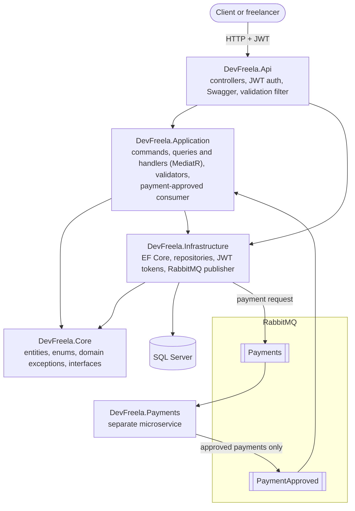
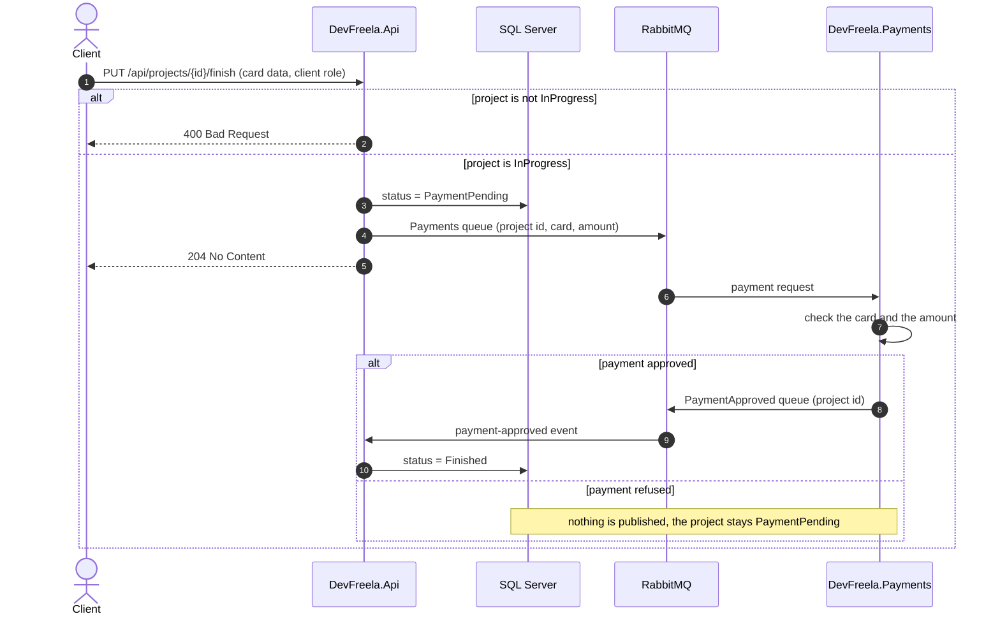

# DevFreela

[](https://github.com/joaogqueiroz/DevFreela/actions/workflows/ci.yml)

A REST API for a freelancing marketplace. Clients post projects, freelancers work on them, and payment runs asynchronously through a separate microservice over RabbitMQ.

Built with ASP.NET Core 8 using CQRS with MediatR and a layered, clean-architecture layout.

## Architecture



- **CQRS:** every write is a command (`CreateProject`, `StartProject`, `FinishProject`, `CreateComment`, `LoginUser`…) and every read is a query, each with its own handler.
- **Auth:** JWT bearer tokens with `client` and `freelancer` roles.
- **Async payments:** finishing a project publishes the payment details to the `Payments` queue and sets the project to `PaymentPending`. The [DevFreela.Payments](https://github.com/joaogqueiroz/DevFreela.Payments) service processes it and, when the payment is approved, publishes a payment-approved event, which a background consumer in this API picks up to finish the project.

## Payment flow



## Endpoints

| Method | Route | Role |
| --- | --- | --- |
| GET | `/api/projects?query=` | client, freelancer |
| GET | `/api/projects/{id}` | client, freelancer |
| POST | `/api/projects` | client |
| PUT | `/api/projects/{id}` | client |
| DELETE | `/api/projects/{id}` | client |
| POST | `/api/projects/{id}/comments` | client, freelancer |
| PUT | `/api/projects/{id}/start` | client |
| PUT | `/api/projects/{id}/finish` | client |
| GET | `/api/skills` | authenticated |
| GET | `/api/users/{id}` | authenticated |
| POST | `/api/users` | |
| PUT | `/api/users/login` | |

Swagger UI is available in Development, with a Bearer token button.

## Tech stack

C# · .NET 8 · ASP.NET Core · Entity Framework Core · SQL Server · MediatR · FluentValidation · JWT · RabbitMQ · Swagger · xUnit · Moq · Docker Compose

## Running locally

Requirements: .NET 8 SDK and Docker.

```sh
# RabbitMQ (management UI at http://localhost:15672, guest/guest) and SQL Server
docker compose up -d

# create the database
dotnet ef database update --project DevFreela.Infrastructure --startup-project DevFreela.Api

# run the API
dotnet run --project DevFreela.Api
```

The connection string in `DevFreela.Api/appsettings.json` (`ConnectionStrings:DevFreelaCs`) points to the SQL Server container from `docker-compose.yml`.

The RabbitMQ connection is set in the `RabbitMQ` section of the same file.

To run the payment flow end to end, also start [DevFreela.Payments](https://github.com/joaogqueiroz/DevFreela.Payments).

## Tests

- `DevFreela.UnitTests` (xUnit + Moq) covers the entities, the command handlers and the validators: unknown projects, finishing only projects in progress, saving PaymentPending before the payment is requested, sign-up rules and project costs.
- `DevFreela.ApiTests` starts the whole API with `WebApplicationFactory` against SQL Server and RabbitMQ from [Testcontainers](https://dotnet.testcontainers.org/). It checks the HTTP behavior: wrong JSON types and malformed bodies (400), validation messages, missing tokens (401), the wrong role (403), unknown ids (404) and finishing a project twice.

```sh
dotnet test                         # both projects, needs Docker running
dotnet test DevFreela.UnitTests     # no Docker needed
```
